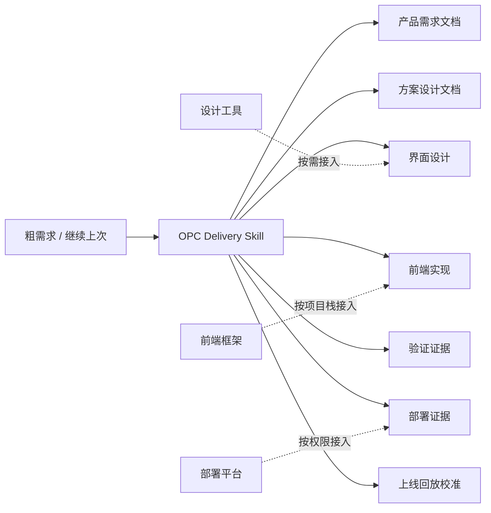
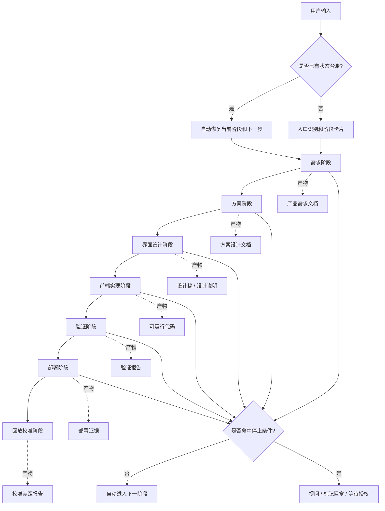
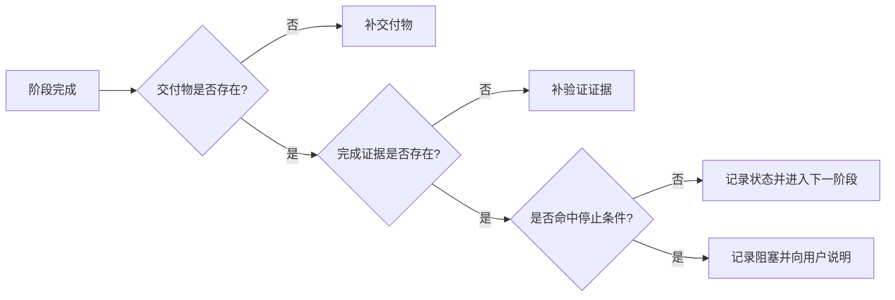
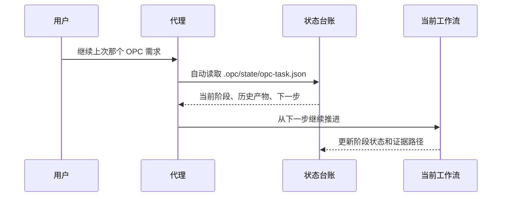
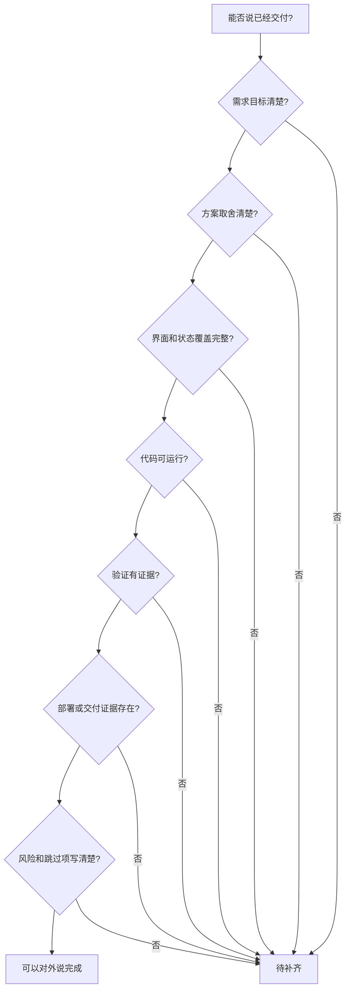
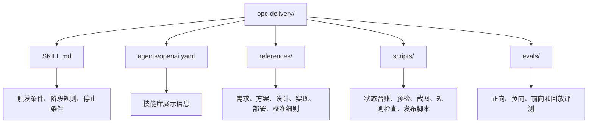
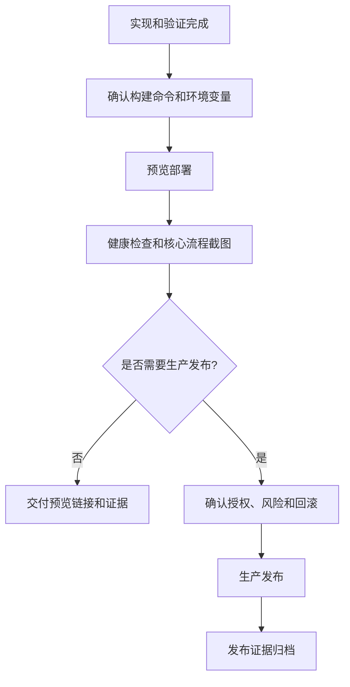
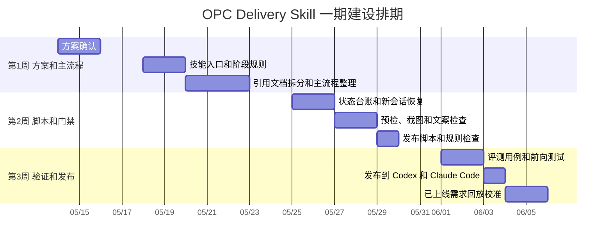
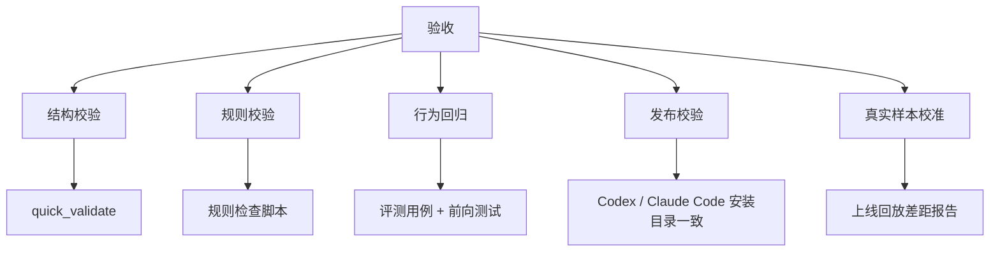

# OPC Delivery Skill 建设方案

> 版本: v1.1  
> 日期: 2026-05-14  
> 范围: OPC Delivery Skill 一期能力建设、发布和首轮校准

## 1. 背景和目标

现在要做的不是一个“设计稿转代码”小工具，也不是把原来的 MasterGo 能力再包装一层。
真正要解决的是：业务同学只给一个粗需求时，AI 能不能像一个小型交付团队一样，把需求澄清、方案设计、界面设计、前端实现、验证、部署和上线回放连续推进下去。

OPC Delivery Skill 的目标是把这条交付路径沉淀成一个可复用技能。用户不用懂产品、设计、前端和部署流程，只要说明要做什么；技能负责判断当前阶段、补齐必要信息、产出阶段交付物，并在没有硬阻塞时自动进入下一阶段。

| 目标 | 判断方式 |
|---|---|
| 从粗需求进入完整交付流程 | 能先形成阶段卡片和产品需求文档，而不是直接写页面 |
| 每个阶段都有可交付产物 | 需求、方案、设计、实现、验证、部署、校准都有文件或证据 |
| 不靠聊天上下文续命 | 新会话能从状态台账恢复当前阶段和下一步 |
| 不误报完成 | 没有验证证据、部署证据或明确跳过原因时，不说已完成 |
| 能持续变好 | 已上线需求回放后，能反向补规则、评测和脚本 |

## 2. 技能定位

一句话定义：

> OPC Delivery Skill 是一个面向“从粗需求到上线交付”的产品交付技能。它不只生成文档或页面，而是按阶段推进、留下证据、处理阻塞，并把真实交付经验沉淀回技能本身。



MasterGo、Codify、Figma、React、Next、Vite、Vercel、GitHub Actions 和服务器部署都只是可选接入点。主线不是某个工具，而是“把需求交付上线”的过程。

## 3. 一期建设范围

### 一期要做

| 范围 | 说明 |
|---|---|
| 入口识别 | 判断是新需求、继续上次、已上线回放，还是局部阶段任务 |
| 需求阶段 | 输出阶段卡片、产品需求文档、验收标准和待确认问题 |
| 方案阶段 | 输出方案设计文档、候选方案、推荐方案、排期和风险 |
| 界面设计阶段 | 输出设计门禁卡、页面状态清单、设计稿或可实现设计说明 |
| 前端实现阶段 | 按项目栈实现可运行代码，说明组件、状态、接口和数据策略 |
| 验证阶段 | 运行能跑的检查，形成测试、构建、浏览器和核心流程证据 |
| 部署阶段 | 默认预览部署，生产部署必须有明确授权和回滚方案 |
| 回放校准阶段 | 用已上线需求做差距报告，反向更新规则、评测和脚本 |
| 状态台账 | 用 `.opc/state/opc-task.json` 记录当前阶段、产物路径和下一步 |

### 一期不做

| 不做 | 原因 |
|---|---|
| 不把一句需求直接变成页面 | 容易漏角色、流程、权限、数据和验收标准 |
| 不默认生产部署 | 涉及权限、密钥、数据安全和回滚风险 |
| 不把模拟稿当真实上线结果 | 交付物类型必须说清楚 |
| 不把命令成功当业务完成 | 还要证明核心流程真的可用 |
| 不把所有行业知识塞进 `SKILL.md` | 按技能创建规范拆到引用文档，避免上下文过大 |

## 4. 总体工作流



默认规则很简单：用户没有说暂停或停下，就继续往后推。只有三类情况停下来：

- 继续做会产生高风险副作用，比如生产发布、删除数据、改密钥；
- 关键信息缺失，且无法用合理默认值推进；
- 用户明确要求暂停、停止或只做某一阶段。

## 5. 核心机制

### 5.1 阶段自动轮转

阶段卡片是入口判断，不是每一步都等用户点头的卡点。它要写清楚真实交付物、当前阶段、验收方式、风险缺口、停止条件和下一步。



每个阶段都必须留下三样东西：

- 本阶段交付物；
- 完成证据；
- 下一阶段输入。

缺任何一个，都不能对外说“完成”。

### 5.2 断点续跑和新会话恢复

这个能力必须对用户无感。用户不需要运行命令，也不需要复制状态文件。



状态台账只存摘要、路径和下一步，不存完整产品需求文档、方案正文、日志和代码。大产物按阶段拆到 `.opc/<阶段>/` 下面，避免后续会话一上来就吞掉大量上下文。

| 字段 | 用途 |
|---|---|
| `currentPhase` | 当前应该恢复到哪个阶段 |
| `nextAction` | 新会话进来后第一件要做的事 |
| `recentHistory` | 最近做过什么，避免重复劳动 |
| `artifact` | 阶段交付物路径 |
| `evidence` | 验证、部署或阻塞证据 |

### 5.3 完成口径



完成不是一句“已实现”。完成要能回答四个问题：

- 做的是不是用户真正要的东西；
- 为什么采用这个方案；
- 代码和页面是否真的可运行；
- 如果上线或交付，证据在哪里、风险在哪里。

### 5.4 技能结构

按 `skill-creator` 的原则，`SKILL.md` 保持短，只放入口、路由和硬规则；细节拆到引用文档；重复且容易出错的动作放脚本；关键行为用评测守住。



## 6. 阶段交付设计

| 阶段 | 目标 | 主要产物 | 完成条件 |
|---|---|---|---|
| 入口识别 | 判断任务类型和当前阶段 | 阶段卡片 | 交付类型、验收方式、停止条件明确 |
| 需求阶段 | 把粗需求变成可执行范围 | `.opc/requirements/prd.md` | 必做、不做、验收标准、阻塞项清楚 |
| 方案阶段 | 给实现和设计一个可落地方案 | `.opc/solution/solution-design.md` | 覆盖必做范围，说明取舍、排期和风险 |
| 界面设计阶段 | 明确页面、状态和交互 | 设计门禁卡、页面状态清单、设计稿或设计说明 | 关键角色、流程、空态、错误、成功态覆盖 |
| 前端实现阶段 | 产出可运行代码 | 代码、接口字段映射、数据策略 | 核心流程可操作，项目能本地运行 |
| 验证阶段 | 证明实现可用 | `.opc/verification/report.md` | 检查、测试、构建、浏览器验证能跑的都已跑 |
| 部署阶段 | 给出可访问交付结果 | `.opc/deployment/release.md` | 预览可访问，生产发布有授权和回滚方案 |
| 回放校准阶段 | 让技能从真实结果里变好 | `.opc/calibration/<feature>-gap-report.md` | 差距分类，规则、评测或脚本有更新 |

### 验证阶段补充

验证阶段要单独存在，不能夹在实现阶段的一句话里。推荐检查顺序：


如果某个检查因为项目条件无法执行，要写明原因和替代证据，不能静默跳过。

### 部署阶段补充

部署默认先做预览环境。生产环境只有在用户明确授权、环境变量明确、回滚方案存在时才推进。



## 7. 排期计划

一期按 3 周推进。第一周定流程和结构，第二周补脚本和评测，第三周发布并用真实样本校准。



| 时间 | 里程碑 | 交付物 | 验收方式 |
|---|---|---|---|
| 05/15 | 方案确认 | 本方案、一期范围、排期 | 评审通过，主题不再落到 MasterGo 升级 |
| 05/22 | 主流程定稿 | `SKILL.md`、核心引用文档 | 能从粗需求走到各阶段产物 |
| 05/29 | 脚本和门禁完成 | 状态、预检、规则检查、发布脚本 | 脚本可执行，规则检查通过 |
| 06/03 | 技能发布 | Codex 和 Claude Code 技能库可用 | 安装目录与源码一致 |
| 06/05 | 首轮校准 | 一个已上线需求回放报告 | 差距已分类，规则或评测已补充 |

## 8. 验收标准



| 验收项 | 标准 |
|---|---|
| 技能结构 | 符合 `skill-creator` 要求，`SKILL.md` 精简，细节拆到 `references/` |
| 自动轮转 | 用户未说暂停或停下时，阶段完成后自动进入下一阶段 |
| 状态恢复 | 新会话只需说“继续上次”，代理自动读取状态台账并继续 |
| 阶段产物 | 需求、方案、设计、实现、验证、部署、校准都有产物路径 |
| 完成证据 | 测试、构建、浏览器、部署或阻塞证据写清楚 |
| 发布结果 | Codex 和 Claude Code 技能库均可使用 |
| 回放校准 | 至少一个已上线需求完成回放，差距能转成规则或评测 |

建议执行的检查：

```bash
uv run --with pyyaml python /Users/sunshine/.codex/skills/.system/skill-creator/scripts/quick_validate.py opc-delivery
python3 opc-delivery/scripts/check-skill-rules.py
python3 scripts/check-evals.py
python3 scripts/check-links.py
python3 scripts/publish-opc-delivery-skill.py
```

## 9. 风险和处理方式

| 风险 | 影响 | 处理方式 |
|---|---|---|
| 粗需求信息不足 | 产品需求文档偏离真实意图 | 只问阻塞问题，非阻塞问题写默认假设并继续 |
| 阶段太多显得慢 | 用户觉得流程重 | 支持轻量模式，但保留阶段卡片、验收标准和状态记录 |
| 阶段产物变成停点 | 交付停在文档或设计稿 | 明确阶段完成后自动进入下一阶段 |
| 新会话丢上下文 | 任务需要重讲一遍 | 状态台账记录当前阶段、历史产物和下一步 |
| 工具或令牌缺失 | 设计、部署或验证无法真实执行 | 标记阻塞，不用假产物冒充完成 |
| 评测只测话术 | 技能行为容易退化 | 增加状态文件、脚本检查、前向测试和回放评测 |
| 生产发布权限不清 | 发布风险不可控 | 默认预览部署，生产发布必须明确授权 |

## 10. 推进建议

一期先把 OPC Delivery Skill 做成稳定、可恢复、可验证的交付技能。重点不是追求“一句话直接上线”，而是保证它每往前走一步都有产物、有证据、有下一步。

等首轮已上线需求回放完成后，再决定哪些环节继续自动化。优先补那些真实回放中反复出现的问题，比如需求缺字段、设计状态漏覆盖、验证证据不足、部署前风险检查不完整。
